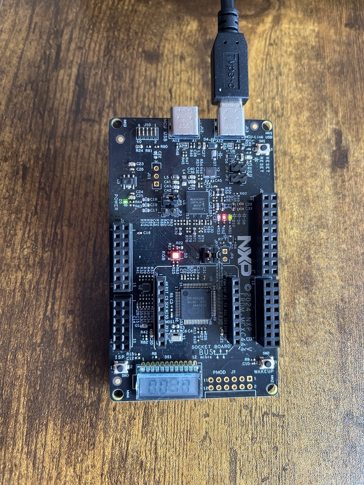

# NXP Application Code Hub

## SLCD and FXLS8974 Accelerometer Demo on MCXC444
*This demo uses the on board FXL8974 3-axis Low G accelerometer to obtain real time acceleration data, the on board RGB LED to indicate the orientation, and the SLCD interface prints out the y acceleration data.*

#### Boards: FRDM-MCXC444
#### Categories: HMI, Sensor
#### Peripherals: I2C
#### Toolchains: MCUXpresso IDE

## Table of Contents
1. [Software](#step1)
2. [Hardware](#step2)
3. [Setup](#step3)
4. [Results](#step4)
5. [FAQs](#step5) 
6. [Support](#step6)
7. [Release Notes](#step7)

## 1. Software
*This software was developed in MCUXpresso IDE, this demo is in baremetal. The application starts when the user powers on the board or starts a debugging session, after that you can see the Red and Blue LEDs will change their brightness depending on the orientation of the FRDM-MCXC444 board. The SLCD interface will also enumerate https://nxp.com/mcuxpresso.*

- [MCUXpresso IDE v11.9.0 or newer.](https://www.nxp.com/design/design-center/software/development-software/mcuxpresso-software-and-tools-/mcuxpresso-integrated-development-environment-ide:MCUXpresso-IDE)

## 2. Hardware
*For this demo you will need the FRDM-MCXC444 board linked below.*

- [MCX C444 FRDM Board.](https://www.nxp.com/design/design-center/development-boards-and-designs/general-purpose-mcus/frdm-development-board-for-mcx-c444-mcus:FRDM-MCXC444)

- Personal Computer
- Mini/micro C USB cable

## 3. Setup
*After cloning the repository and importing it to the workspace connect the board to the pc using a USB cable in the J13 header.* 

*Build and compile the project, debug, then select the target and push play to run the application.*

*Open a serial terminal (RealTerm) with the following settings:*
- 115200 baud rate
- 8 data bits
- No parity
- One stop bit
- No flow control

## 4. Results
*When the X-axis acceleration is close to 1G, the blue LED will be full brightness. When the Y-Axis acceleration is close to 1G the Red LED will be full brightness. When X and Y axes are at 45 degrees respectively, you will see a pink/purple color, corresponding to both LEDs being on at the same time.*

*The SLCD interface will display the Y axis acceleration in terms of G. When the board is tilted horizontally the SLCD interface will display a value close to 1G. When the board is tilted vertically this number should be close to zero.*

*A serial terminal will additionally print out the values of the X, Y, and Z acceleration data.*

## 5. FAQs
No FAQs have been identified for this project.

## 6. Support

#### Project Metadata
<!----- Boards ----->

<!----- Categories ----->
 

<!----- Peripherals ----->
 

<!----- Toolchains ----->

Questions regarding the content/correctness of this example can be entered as Issues within this GitHub repository.

>**Warning**: For more general technical questions regarding NXP Microcontrollers and the difference in expected funcionality, enter your questions on the [NXP Community Forum](https://community.nxp.com/)

## 7. Release Notes
| Version | Description / Update                           | Date                        |
|:-------:|------------------------------------------------|----------------------------:|
| 1.0     | Initial release on Application Code Hub        | Oct 10 th 2024 |